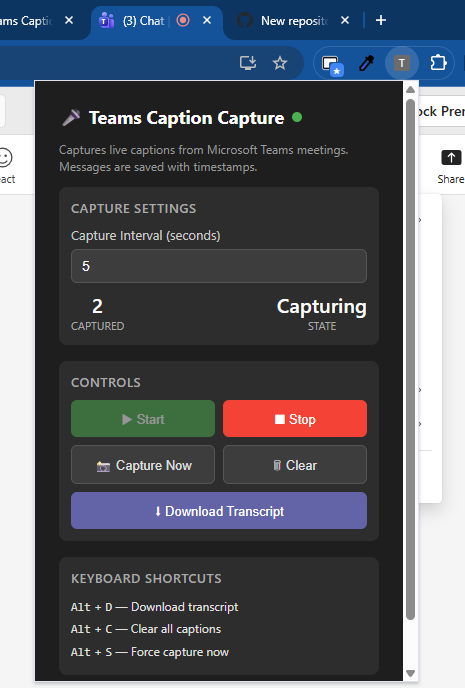
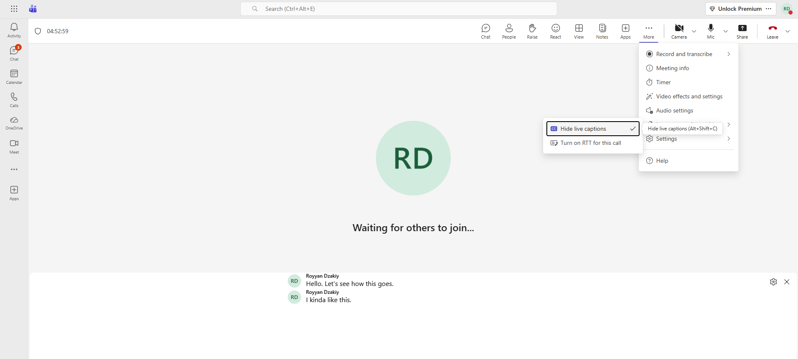
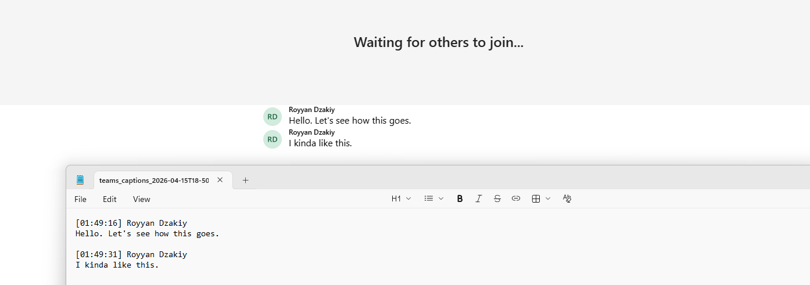

# Teams Live Caption Capture

A browser extension designed to programmatically capture, timestamp, and export live closed captions from Microsoft Teams meetings. This tool provides a reliable way to maintain meeting transcripts locally without relying on built-in recording or transcription services that may be restricted by organization policies.

---

## Features

* **Real-Time Capture**: Periodically scans the Teams DOM to extract caption text and speaker names.
* **Automatic Finalization**: Uses a stability algorithm to ensure messages are only finalized once the speaker has paused or finished a sentence.
* **Deduplication**: Filters out redundant DOM elements and consecutive identical captures to ensure a clean transcript.
* **Auto-Download on Exit**: Monitors the presence of the caption window; if captions disappear (indicating the meeting has ended), it automatically triggers a transcript download.
* **Manual Controls**: Custom capture intervals, manual force-capture, and clearing of local session memory.
* **Keyboard Shortcuts**: High-efficiency triggers for downloading, clearing, and capturing.
* **Privacy-Focused**: All data stays within the browser session until downloaded. No data is sent to external servers.

---

## Installation and Setup

1.  **Enable Developer Mode**: Open your browser's extension management page (`chrome://extensions`). Toggle the **Developer mode** switch in the top right corner.
2.  **Load Extension**: Click **Load unpacked** and select the directory containing the extension files (`manifest.json`, `capture.js`, `popup.js`, `popup.html`).
3.  **Enable Captions in Teams**: Start or join a Microsoft Teams meeting via the web browser. You **must** turn on **Live Captions** within the Teams "More" menu for the extension to function.
4.  **Pin for Easy Access**: Pin the extension to your toolbar to monitor capture status and message counts.

---

## Usage Instructions

### Basic Operation
Once the meeting starts and captions are enabled, the extension starts capturing automatically at a default 10-second interval. 

### Customizing the Interval
Access the extension popup and modify the **Capture Interval**. 
* **Short intervals (3-5s)**: Better for fast-paced discussions but higher CPU overhead.
* **Long intervals (10-20s)**: Efficient for long presentations.

### Exporting Data
Click **Download Transcript** to generate a `.txt` file. The format is as follows:
`[HH:MM:SS] Speaker Name`
`Message content text.`

---

## Controls and Shortcuts

| Action | Control Button | Shortcut |
|:---|:---|:---|
| **Download Transcript** | Download Transcript | `Alt + D` |
| **Clear Local Memory** | Clear | `Alt + C` |
| **Manual Capture** | Capture Now | `Alt + S` |
| **Start/Stop Capture** | Start / Stop | N/A |

---

## Technical Limitations

* **DOM Dependency**: This extension relies on specific Microsoft Teams CSS classes (`.fui-ChatMessageCompact`) and data attributes (`data-tid`). If Microsoft updates the Teams UI structure, the extension may require an update to its selectors.
* **Caption Visibility**: The extension can only capture what is rendered on the screen. If live captions are turned off in the Teams interface, the capture process will pause.
* **Background Throttling**: If the Teams tab is discarded or heavily throttled by the browser's energy-saver mode, capture intervals may become irregular. Keeping the Teams tab active or in a separate window is recommended.
* **Memory Management**: Captured messages are stored in a local `Map`. While there is a 30-minute cleanup cycle for stale data, extremely long meetings (4+ hours) with high-density captions may increase browser memory usage. It is recommended to download and clear the transcript periodically for very long sessions.

---

## Screenshots

